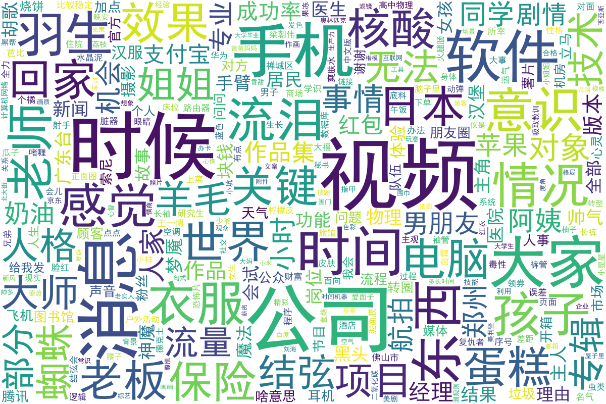
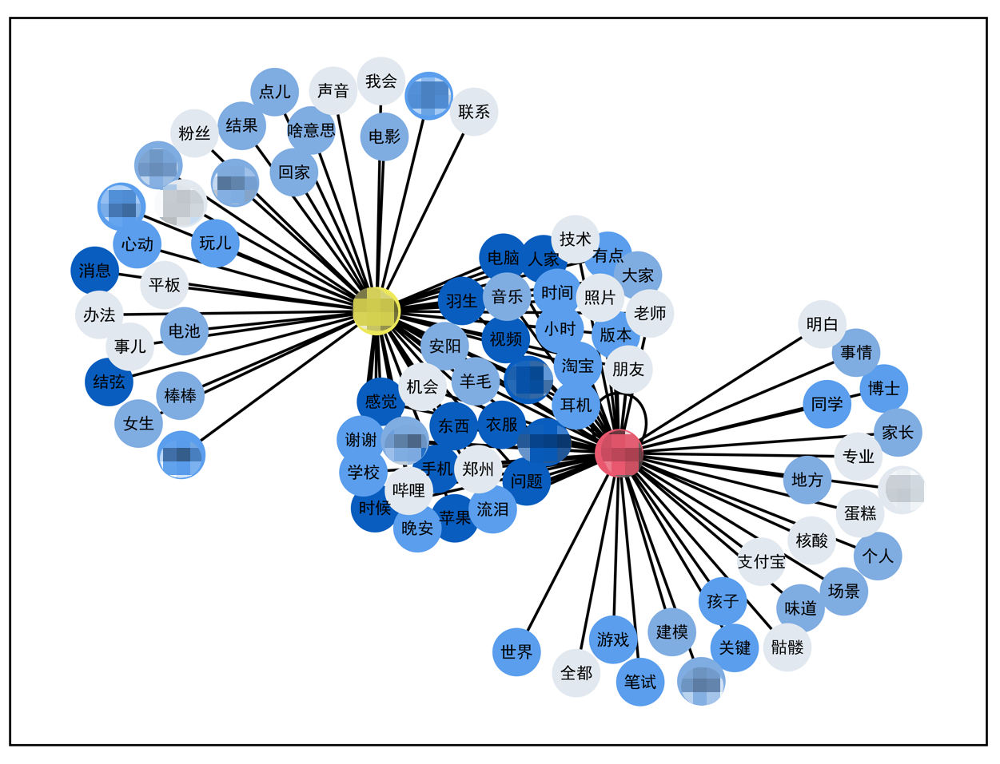
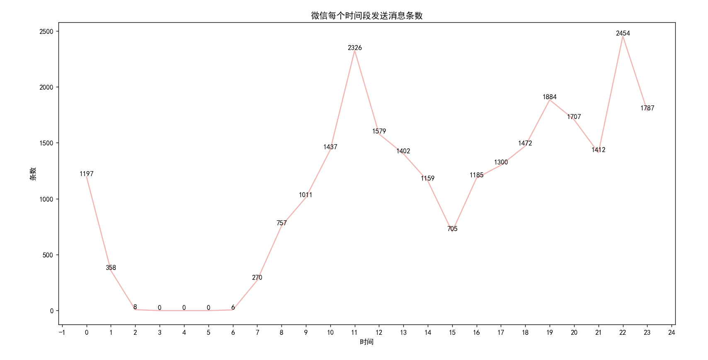
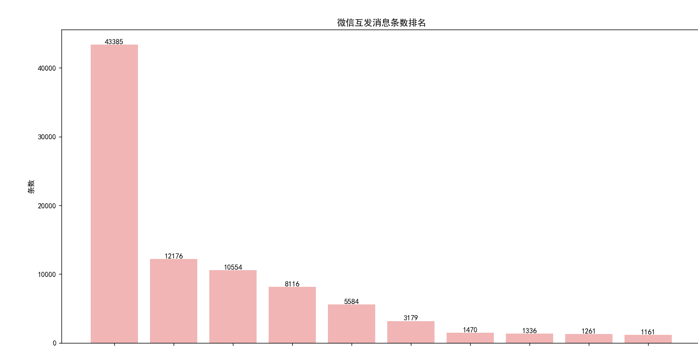

# 微信聊天记录统计 
从网上收集来，并进行了修改，现在是可用的状态。

|  文件用法   | 说明  | 预览 |
|  ----  | ----  | ---- |
| python paint.py  | 词云图 ||
| python paint2.py  | 高频词图 ||
|python time.py time.txt| 消息时段统计||
| python people.py people.txt| 聊天前十||

 
## 注意
词云和高频词 还需要改一下文件里的引用文件名等。
可以直接丢sqlcipher导出的文件，

可以筛选出来单独的一个人，根据isSend来判定是谁
### 字体问题
参照这个解决
https://blog.csdn.net/fwj_ntu/article/details/105598145